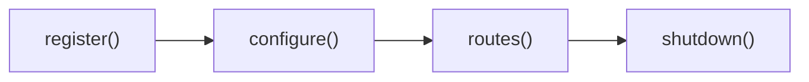

# Bootstrap

O **bootstrap** é o ponto de entrada de qualquer projeto Expresso Flow. Internamente utiliza **FastAPI** e **Uvicorn** como servidor HTTP, e segue um padrão **Singleton** — uma única instância por processo.

---

## `ExpressoFlowBootstrap`

```python
from exflow.application.bootstrap import ExpressoFlowBootstrap
```

### Construtor

```python
bootstrap = ExpressoFlowBootstrap(
    host="localhost",          # Host do servidor (padrão: "localhost")
    port=8080,                 # Porta do servidor (padrão: 8080)
    bundles=[],                # Bundles adicionais
    is_debug=False,            # Ativa modo debug
    class_loader_paths=[],     # Pastas extras para carregamento automático de flows
)
```

| Parâmetro | Tipo | Padrão | Descrição |
|-----------|------|--------|-----------|
| `host` | `str` | `"localhost"` | Host de escuta do servidor |
| `port` | `int` | `8080` | Porta do servidor |
| `bundles` | `list[Bundle]` | `[]` | Bundles adicionais registrados após os padrão |
| `is_debug` | `bool` | `False` | Ativa logs detalhados via `IS_DEBUG` env |
| `class_loader_paths` | `list[str]` | `[]` | Pastas extras para o `FlowLoaderBundle` carregar automaticamente |

---

## Método `run()`

Inicia o servidor Uvicorn e bloqueia a thread principal:

```python
if __name__ == "__main__":
    bootstrap.run()
```

Internamente, `run()` inicializa os bundles na seguinte ordem:

1. **`register()`** — cada bundle registra seus componentes no bootstrap
2. **`configure()`** — cada bundle aplica suas configurações
3. **`routes()`** — cada bundle adiciona suas rotas FastAPI
4. **`shutdown()`** — executado ao encerrar (`CTRL+C`)

---

## Singleton — `get_instance()`

O bootstrap é acessível de qualquer parte da aplicação após a inicialização:

```python
from exflow.application.bootstrap import ExpressoFlowBootstrap

bootstrap = ExpressoFlowBootstrap.get_instance()
```

!!! warning
    Chamar `get_instance()` antes de instanciar o `ExpressoFlowBootstrap` lança `RuntimeError`.

---

## Bundles padrão

O bootstrap registra automaticamente os seguintes bundles **antes** dos bundles customizados:

| Bundle | Descrição |
|--------|-----------|
| `ConfigDefaultBundle` | Configurações padrão da aplicação |
| `DefaultIntentsBundle` | Intents padrão do engine de IA |
| `FailureRecoveryBundle` | Políticas de recuperação de falhas |
| `InfoBundle` | Endpoint de informações da aplicação |
| `FlowApiBundle` | API REST para execução de flows |
| `FlowLoaderBundle` | Carregamento automático de flows por pasta |

### Pastas de carregamento automático (`FlowLoaderBundle`)

Os flows são carregados automaticamente a partir das seguintes pastas:

```
app/flows/         ← flows conversacionais
app/metaflows/     ← flows de meta-orquestração
app/services/      ← serviços internos
app/apis/          ← integrações com APIs externas
app/providers/     ← provedores de dados
app/llms/          ← agentes e integrações de IA
```

Para adicionar pastas extras:

```python
bootstrap = ExpressoFlowBootstrap(
    class_loader_paths=["app/custom", "app/integrations"],
)
```

---

## Bundle

O sistema de bundles é o mecanismo oficial de extensão do Expresso Flow. Seu objetivo é permitir que qualquer desenvolvedor expanda as capacidades do framework — adicionando canais de comunicação, integrações externas, repositórios de dados, rotas HTTP, políticas de recuperação, agentes de IA e qualquer outro componente — sem modificar o núcleo do framework.

Um bundle encapsula um conjunto coeso de funcionalidades e se integra ao ciclo de vida da aplicação através de hooks executados pelo `ExpressoFlowBootstrap` durante a inicialização e o encerramento. Os próprios canais oficiais (WhatsApp, WebFlow, etc.) são implementados como bundles.

```python
from exflow.application.bundle import Bundle
from exflow.application.bootstrap import ExpressoFlowBootstrap
```

### Classe base

```python
class Bundle(ABC):

    def configure(self, bootstrap: ExpressoFlowBootstrap) -> None:
        """Configurações aplicadas após o registro de todos os bundles."""
        pass

    def register(self, bootstrap: ExpressoFlowBootstrap) -> None:
        """Registro de componentes (repositórios, serviços, etc.) no bootstrap."""
        pass

    def routes(self, bootstrap: ExpressoFlowBootstrap) -> list[APIRouter]:
        """Rotas FastAPI expostas pelo bundle."""
        return []

    def shutdown(self) -> None:
        """Executado ao encerrar a aplicação."""
        pass
```

### Ciclo de vida

A ordem de execução dos hooks segue o ciclo definido pelo `ExpressoFlowBootstrap`:



| Hook | Quando é chamado | Uso típico |
|------|-----------------|------------|
| `register()` | Antes de `configure()` | Registrar repositórios, fábricas e serviços no bootstrap |
| `configure()` | Após todos os `register()` | Aplicar configurações que dependem de outros bundles já registrados |
| `routes()` | Após `configure()` | Adicionar rotas FastAPI (`APIRouter`) à aplicação |
| `shutdown()` | Ao encerrar (`CTRL+C`) | Fechar conexões, liberar recursos |

### Criando um bundle customizado

```python
from fastapi import APIRouter
from exflow.application.bundle import Bundle
from exflow.application.bootstrap import ExpressoFlowBootstrap


class MeuBundle(Bundle):

    def register(self, bootstrap: ExpressoFlowBootstrap) -> None:
        bootstrap.meu_servico = MeuServico()

    def configure(self, bootstrap: ExpressoFlowBootstrap) -> None:
        bootstrap.meu_servico.configure(debug=True)

    def routes(self, bootstrap: ExpressoFlowBootstrap) -> list[APIRouter]:
        router = APIRouter(prefix="/meu-bundle")

        @router.get("/status")
        def status():
            return {"status": "ok"}

        return [router]

    def shutdown(self) -> None:
        bootstrap.meu_servico.close()
```

Registre o bundle no bootstrap:

```python
bootstrap = ExpressoFlowBootstrap(
    bundles=[
        MeuBundle(),
    ]
)
```

---

## Exemplo mínimo

```python title="main.py"
from exflow.application.bootstrap import ExpressoFlowBootstrap
from webflow_bundle import WebflowBundle

bootstrap = ExpressoFlowBootstrap(
    bundles=[
        WebflowBundle(),
    ]
)

if __name__ == "__main__":
    bootstrap.run()
```

Com o `WebflowBundle` registrado, acesse `http://localhost:8080/webflow` no navegador para interagir com os flows.

---

## Próximos passos

- [Flows →](flow.md)
- [Bundles →](bundles.md)
- [Configuração →](configuration.md)
