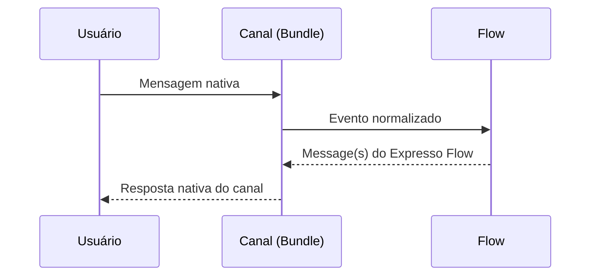

# Canais

Os **canais** são os pontos de entrada e saída das mensagens no Expresso Flow. Cada canal representa uma plataforma de comunicação (WhatsApp, Telegram, ChatWeb, etc.) e é integrado ao framework via um **bundle** específico.

---

## Canais disponíveis

| Canal | Pacote | Bundle | Status |
|-------|--------|--------|--------|
| **WhatsApp** | `exflow-whatsapp` | `WhatsAppBundle` | Disponível |
| **Telegram** | `exflow-telegram` | `TelegramBundle` | Disponível |
| **ChatWeb** | `exflow-chatweb` | `ChatWebBundle` | Disponível |
| **WebFlow** *(debug)* | `exflow-webflow` | `WebFlowBundle` | Disponível |

---

## Como funcionam os canais

Cada canal bundle:

1. Escuta eventos externos (webhooks, polling, WebSocket, etc.)
2. Normaliza as mensagens recebidas para o formato interno do Expresso Flow
3. Roteia a mensagem ao **flow** correspondente
4. Recebe a resposta do flow e a converte para o formato nativo do canal



---

## Instalação

```bash
pip install --index-url https://exflow.run/simple exflow-whatsapp
pip install --index-url https://exflow.run/simple exflow-telegram
pip install --index-url https://exflow.run/simple exflow-chatweb
```

---

## Documentação de cada canal

<div class="grid cards" markdown>

- :fontawesome-brands-whatsapp: **[WhatsApp](whatsapp.md)**

    Integração com a API oficial do WhatsApp Business.

- :fontawesome-brands-telegram: **[Telegram](telegram.md)**

    Bot API do Telegram com suporte a polling e webhook.

- :material-chat: **[ChatWeb](chatweb.md)**

    Widget de chat embeddable para sites e aplicações web.

</div>

---

## Roteamento entre canais

Um mesmo flow pode ser acessado por múltiplos canais simultaneamente. O roteamento é feito pelo slug do flow:

```python
from expresso_flow import ExpressoFlow
from exflow_whatsapp import WhatsAppBundle
from exflow_telegram import TelegramBundle
from flows.atendimento import AtendimentoFlow

app = ExpressoFlow()

app.register_bundle(WhatsAppBundle(token="..."))
app.register_bundle(TelegramBundle(token="..."))

app.flow("atendimento")(AtendimentoFlow)  # Acessível por ambos os canais

if __name__ == "__main__":
    app.run()
```

---

## Próximos passos

- [WhatsApp →](whatsapp.md)
- [Telegram →](telegram.md)
- [ChatWeb →](chatweb.md)
