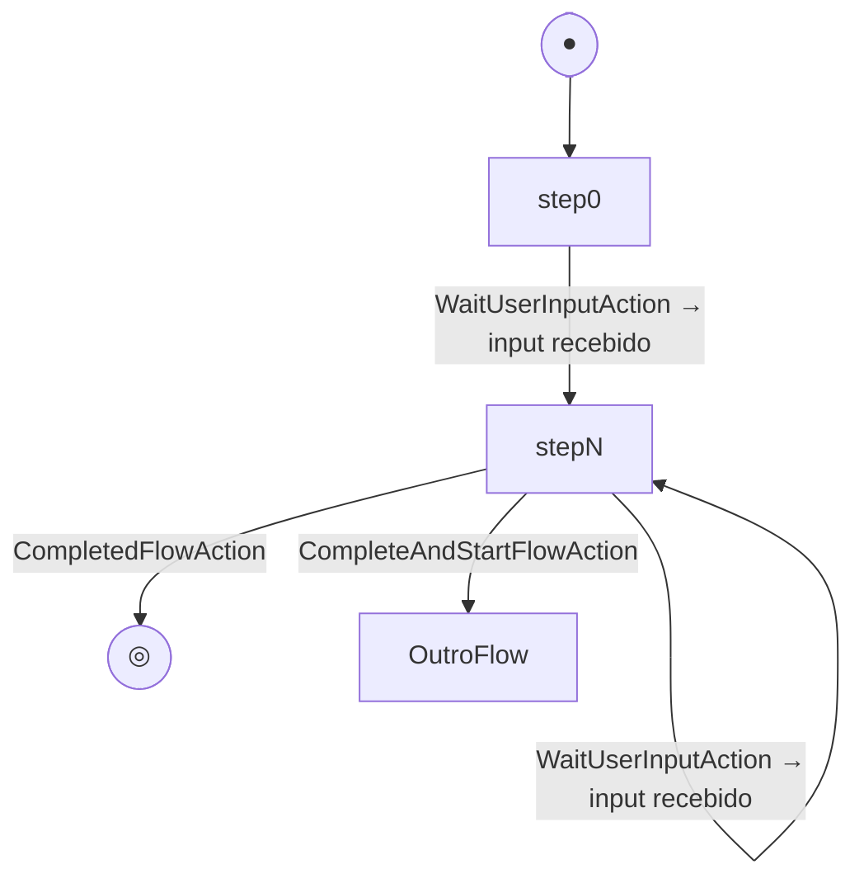

# Flows

Um **Flow** representa uma conversa completa com um usuário. É uma classe Python decorada com `@flow()` que organiza a lógica conversacional em **steps** numerados e sequenciais.

---

## Criando um Flow

```python
from exflow.flow import Flow, StepOptions, step, flow
from exflow.interaction import InteractionContext
from exflow.execution_action import CompletedFlowAction, WaitUserInputAction


@flow()
class MeuFlow(Flow):
    """
    Flow de exemplo — descreva aqui o propósito deste flow.
    Esta docstring é utilizada como description pelo engine de intent.
    """

    id = "meu_flow"
    name = "Meu Flow"

    @step(order=0, label="Início", description="Ponto de entrada do flow")
    async def start(self, ctx: InteractionContext, options: StepOptions):
        await ctx.output.send_text("Olá!")
        return WaitUserInputAction()
```

Toda classe de fluxo deve:

1. Herdar de `Flow`
2. Ser decorada com `@flow()` — registra o flow no container de execução
3. Definir `id` e `name` como atributos de classe
4. Ter pelo menos um método decorado com `@step(0)` (ponto de entrada)

---

## Decorador `@flow()`

Obrigatório em toda classe de flow. Registra o flow no **container de execução** do framework, tornando-o disponível para o runtime e para as interfaces como o WebFlow.

```python
@flow()
class MeuFlow(Flow):
    """Descrição do propósito do flow — utilizada pelo engine de intent."""

    ...
```

---

## Atributos da classe

| Atributo | Tipo | Obrigatório | Descrição |
|----------|------|-------------|-----------|
| `id` | `str` | Sim | Identificador único do flow — usado pelas actions de navegação (`flow_id`) |
| `name` | `str` | Sim | Nome de exibição em todos os ambientes (WebFlow, CLI, WhatsApp, etc.) |
| `description` | `str` | Sim | Propósito do flow — **deve ser declarado como docstring da classe** |

!!! tip "Boa prática: use a docstring"
    A `description` deve ser declarada como **docstring da classe** — ela é automaticamente reconhecida pelo framework e utilizada pelo engine de intent para rotear o usuário ao flow correto.

    ```python
    @flow()
    class SuporteFlow(Flow):
        """
        Atendimento de suporte técnico. Auxilia o usuário a resolver
        problemas com conta, pagamentos e acesso ao sistema.
        """

        id = "suporte"
        name = "Suporte Técnico"
    ```

    O atributo `description` também pode ser declarado diretamente, mas não é recomendado:

    ```python
    description = "Atendimento de suporte técnico."  # alternativa — não recomendado
    ```

---

## Ciclo de vida de um Flow



Os steps são executados em ordem crescente pelo `order` definido em `@step()`. O fluxo avança para o próximo step quando o usuário envia uma mensagem após um `WaitUserInputAction`.

---

## Imports necessários

```python
from exflow.flow import Flow, StepOptions, step, flow
from exflow.interaction import InteractionContext
from exflow.execution_action import CompletedFlowAction, WaitUserInputAction
```

| Símbolo | Descrição |
|---------|-----------|
| `Flow` | Classe base para todos os flows |
| `step` | Decorador que define e ordena um step |
| `flow` | Decorador que registra a classe como um flow |
| `StepOptions` | Metadados e direção de execução injetados em cada step |
| `InteractionContext` | Contexto da interação atual (mensagem, output, sessão) |
| `WaitUserInputAction` | Ação que suspende o flow aguardando input do usuário |
| `CompletedFlowAction` | Ação que encerra o flow |

---

## Sessão do flow (`self.session`)

O flow disponibiliza a propriedade `self.session` para persistir dados entre steps durante a execução da conversa.

```python
from exflow.flow import Flow, StepOptions, step, flow
from exflow.interaction import InteractionContext
from exflow.execution_action import CompletedFlowAction, WaitUserInputAction


@flow()
class CadastroFlow(Flow):
    """Flow de cadastro com uso de sessão."""

    id = "cadastro"
    name = "Cadastro"

    @step(order=0, label="Pedir nome", description="Solicita o nome do usuário")
    async def pedir_nome(self, ctx: InteractionContext, options: StepOptions):
        await ctx.output.send_text("Qual é o seu nome?")
        return WaitUserInputAction()

    @step(order=1, label="Salvar nome", description="Salva o nome e solicita o e-mail")
    async def salvar_nome(self, ctx: InteractionContext, options: StepOptions):
        self.session.set_str("nome", ctx.message.get_text())  # (1)!
        await ctx.output.send_text("Qual é o seu e-mail?")
        return WaitUserInputAction()

    @step(order=2, label="Finalizar", description="Confirma o cadastro")
    async def finalizar(self, ctx: InteractionContext, options: StepOptions):
        nome = self.session.get("nome")  # (2)!
        email = ctx.message.get_text()
        await ctx.output.send_text(f"✅ Cadastro de *{nome}* ({email}) concluído!")
        return CompletedFlowAction()
```

1. `set_str` garante que o valor armazenado é do tipo `str`.
2. `get` retorna `None` se a chave não existir, ou o valor `default` especificado.

### Métodos de `FlowSession`

#### Escrita

| Método | Descrição |
|--------|-----------|
| `set(key, value)` | Armazena qualquer valor |
| `set_str(key, value)` | Armazena como `str` |
| `set_int(key, value)` | Armazena como `int` |
| `set_float(key, value)` | Armazena como `float` |
| `set_bool(key, value)` | Armazena como `bool` |
| `set_list(key, value)` | Armazena como `list` |
| `load(props)` | Carrega múltiplos valores a partir de um `dict` |

#### Leitura

| Método | Retorno | Descrição |
|--------|---------|-----------|
| `get(key, default=None)` | `Any` | Retorna o valor ou `default` se a chave não existir |
| `exists(key)` | `bool` | Verifica se a chave existe na sessão |

```python
# Carregar múltiplos valores de uma vez
self.session.load({"nome": "João", "plano": "pro"})

# Verificar antes de ler
if self.session.exists("nome"):
    nome = self.session.get("nome")
```

!!! info "Escopo da sessão"
    A sessão persiste durante toda a execução do flow para aquela conversa. Ao encerrar o flow (`CompletedFlowAction`, `CancelledFlowAction`, etc.), a sessão é descartada.

---

## Exemplo completo

```python title="app/flows/hellow/hellow_flow.py"
from exflow.flow import Flow, StepOptions, step, flow
from exflow.interaction import InteractionContext
from exflow.execution_action import CompletedFlowAction, WaitUserInputAction


@flow()
class HellowFlow(Flow):
    """
    Flow de boas-vindas que apresenta o bot e coleta o nome do usuário.
    """

    id = "first_flow"
    name = "Meu primeiro fluxo"

    @step(0)
    async def start(self, ctx: InteractionContext, options: StepOptions):
        await ctx.output.send_text(
            (
                "👋 Olá! Eu sou o *Expresso Flow*!\n\n"
                "Como posso te chamar? 😊\n"
            )
        )
        return WaitUserInputAction()

    @step(1)
    async def on_user_input(self, ctx: InteractionContext, options: StepOptions):
        user_input = ctx.message.get_text()

        await ctx.output.send_text(
            (
                f"🎉 Seja muito bem-vindo(a), *{user_input}*!\n\n"
                "Você acaba de rodar o seu primeiro fluxo com o *Expresso Flow* 🚀\n"
            )
        )
        return CompletedFlowAction()
```

---

## Navegação entre flows

Um step pode transitar para outro flow através das **actions de transição**. Todas recebem `flow_id` com o `id` do flow de destino.

| Action | Comportamento no flow atual | Comportamento no flow destino |
|--------|-----------------------------|-------------------------------|
| `ExecuteFlowAction(flow_id)` | Aplica `thread_status` | Executa o flow destino |
| `ForceExecuteFlowAction(flow_id)` | — | Força execução imediata |
| `CompleteAndStartFlowAction(flow_id)` | Conclui | Inicia |
| `SuspendAndStartFlowAction(flow_id)` | Suspende | Inicia |
| `CancelAndStartFlowAction(flow_id)` | Cancela | Inicia |
| `CompleteAndResumeFlowAction(flow_id)` | Conclui | Retoma suspenso |
| `SuspendAndResumeFlowAction(flow_id)` | Suspende | Retoma suspenso |
| `CancelAndResumeFlowAction(flow_id)` | Cancela | Retoma suspenso |

```python
from exflow.execution_action import CompleteAndStartFlowAction

return CompleteAndStartFlowAction(flow_id="suporte")
```

Consulte a [referência completa de ExecutionActions →](steps.md#ações-de-retorno)

---

## Próximos passos

- [Steps →](steps.md)
- [Bootstrap →](bootstrap.md)
- [Referência de API — Flow →](../api/flow.md)
