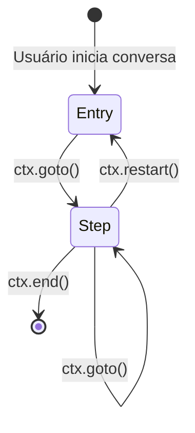

# Flows

Um **Flow** representa uma conversa completa com um usuário. É uma classe Python que herda de `Flow` e organiza a lógica conversacional em **steps** encadeados.

---

## Criando um Flow

```python
from expresso_flow.flow import Flow
from expresso_flow.step import Step, Message


class MeuFlow(Flow):
    """Descrição do fluxo."""

    @Step.entry
    async def inicio(self, ctx):
        await ctx.send(Message.text("Olá!"))
```

Toda classe de fluxo deve:

1. Herdar de `Flow`
2. Ter exatamente **um método decorado com `@Step.entry`** (ponto de entrada)

---

## Registrando um Flow

```python
from expresso_flow import ExpressoFlow
from meus_flows.saudacao import SaudacaoFlow

app = ExpressoFlow()
app.flow("saudacao")(SaudacaoFlow)
```

O **slug** (`"saudacao"`) é o identificador único do fluxo. Os canais utilizam esse slug para rotear usuários ao fluxo correto.

---

## Ciclo de vida de um Flow



---

## Metadados do Flow

Você pode definir metadados na subclasse para configurar o comportamento do fluxo:

```python
class MeuFlow(Flow):
    class Meta:
        name = "Fluxo de Cadastro"         # Nome legível
        description = "Cadastra novos usuários"
        timeout = 300                       # Timeout de sessão em segundos
        default_channel = "whatsapp"        # Canal padrão
```

| Atributo | Tipo | Padrão | Descrição |
|----------|------|--------|-----------|
| `name` | `str` | Nome da classe | Nome exibido no WebFlow |
| `description` | `str` | `""` | Descrição do fluxo |
| `timeout` | `int` | `600` | Tempo (s) até a sessão expirar por inatividade |
| `default_channel` | `str \| None` | `None` | Canal padrão quando não especificado |

---

## Múltiplos Flows

Uma aplicação pode ter quantos flows forem necessários. Cada fluxo é independente e possui seu próprio estado de sessão por usuário.

```python
app.flow("cadastro")(CadastroFlow)
app.flow("suporte")(SuporteFlow)
app.flow("faq")(FaqFlow)
```

---

## Redirecionando entre Flows

Um step pode redirecionar o usuário para outro fluxo:

```python
async def verificar_opcao(self, ctx):
    opcao = await ctx.wait_input()
    if opcao.text == "1":
        await ctx.redirect_flow("cadastro")  # Redireciona para outro flow
    else:
        ctx.goto(self.menu_principal)
```

---

## Próximos passos

- [Steps →](steps.md)
- [Contexto (`ctx`) →](bootstrap.md)
- [Canais →](channels/index.md)
