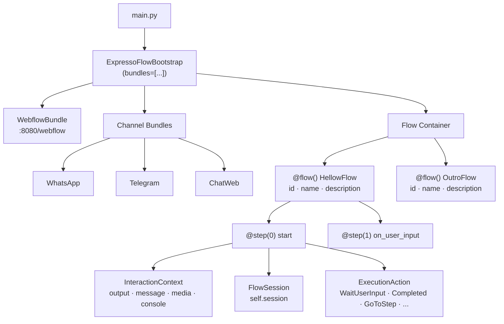

# Core — ExpressoFlow

O módulo **Core** é o coração do framework. Ele provê o motor de execução de fluxos, o sistema de bundles, a abstração de canais e todas as primitivas de construção de conversas.

---

## Instalação

```bash
pip install --index-url https://exflow.run/simple exflow
```

---

## Visão geral da arquitetura



O `ExpressoFlowBootstrap` é o ponto de entrada da aplicação. Ao chamar `bootstrap.run()`, todos os **bundles** registrados são inicializados. Os canais recebem mensagens dos usuários e as roteiam para os **flows** registrados no container, que as processam step a step.

---

## Principais componentes

| Componente | Módulo | Descrição |
|------------|--------|-----------|
| `ExpressoFlowBootstrap` | `exflow.application.bootstrap` | Entry point — inicializa bundles e flows |
| `Flow` | `exflow.flow` | Classe base para criação de flows |
| `flow` | `exflow.flow` | Decorador que registra o flow no container |
| `step` | `exflow.flow` | Decorador que define a ordem e metadados do step |
| `StepOptions` | `exflow.flow` | Metadados injetados em cada step (`direction`, `data`) |
| `InteractionContext` | `exflow.interaction` | Contexto da interação (`output`, `message`, `media`, `console`) |
| `FlowSession` | — | Sessão de dados persistida entre steps (`self.session`) |
| `ExecutionAction` | `exflow.execution_action` | Ações que controlam o fluxo de execução |
| `WebflowBundle` | `webflow_bundle` | Interface web para debug e teste local |

---

## Seções desta documentação

<div class="grid cards" markdown>

- :material-cog: **[Bootstrap](bootstrap.md)**

    Como configurar e inicializar a aplicação `ExpressoFlow`.

- :material-routes: **[Flows](flow.md)**

    Criação e estruturação de fluxos conversacionais.

- :material-step-forward: **[Steps](steps.md)**

    Etapas, navegação e controle de fluxo.

- :material-puzzle: **[Bundles](bundles.md)**

    O sistema de extensão plugável do framework.

- :material-message-processing: **[Canais](channels/index.md)**

    Integração com WhatsApp, Telegram, ChatWeb e outros.

- :material-tune: **[Configuração](configuration.md)**

    Variáveis de ambiente, arquivos de configuração e opções avançadas.

- :material-database: **[Sessão](session.md)**

    Persistência de dados entre steps com `FlowSession`.

- :material-package-variant: **[Pacotes e Agentes](packages.md)**

    Pacotes oficiais e agentes de IA disponíveis no repositório.

</div>
