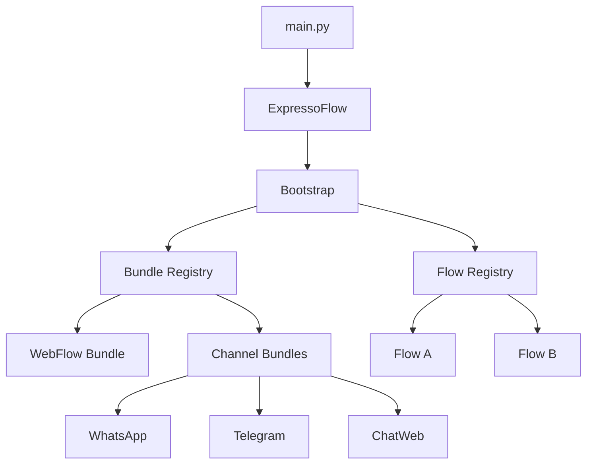

# Core — ExpressoFlow

O módulo **Core** é o coração do framework. Ele provê o motor de execução de fluxos, o sistema de bundles, a abstração de canais e todas as primitivas de construção de conversas.

---

## Instalação

```bash
pip install --index-url https://exflow.run/simple expresso-flow
```

---

## Visão geral da arquitetura



O `ExpressoFlow` é o ponto de entrada da aplicação. No momento do `app.run()`, o bootstrap inicializa todos os **bundles** registrados e começa a escutar eventos dos canais, roteando-os para os **flows** correspondentes.

---

## Principais componentes

| Componente | Módulo | Descrição |
|------------|--------|-----------|
| `ExpressoFlow` | `expresso_flow` | Classe principal — entry point da aplicação |
| `Flow` | `expresso_flow.flow` | Classe base para criação de fluxos |
| `Step` | `expresso_flow.step` | Decoradores e primitivas de etapas |
| `Message` | `expresso_flow.step` | Abstração de mensagens multi-canal |
| `Context` | `expresso_flow.context` | Objeto de contexto injetado em cada step |
| `Bundle` | `expresso_flow.bundle` | Classe base para bundles |
| `Channel` | `expresso_flow.channel` | Classe base para canais |

---

## Seções desta documentação

<div class="grid cards" markdown>

- :material-cog: **[Bootstrap](bootstrap.md)**

    Como configurar e inicializar a aplicação `ExpressoFlow`.

- :material-routes: **[Flows](flows.md)**

    Criação e estruturação de fluxos conversacionais.

- :material-step-forward: **[Steps](steps.md)**

    Etapas, navegação e controle de fluxo.

- :material-puzzle: **[Bundles](bundles.md)**

    O sistema de extensão plugável do framework.

- :material-message-processing: **[Canais](channels/index.md)**

    Integração com WhatsApp, Telegram, ChatWeb e outros.

- :material-tune: **[Configuração](configuration.md)**

    Variáveis de ambiente, arquivos de configuração e opções avançadas.

- :material-package-variant: **[Pacotes e Agentes](packages.md)**

    Pacotes oficiais e agentes de IA disponíveis no repositório.

</div>
