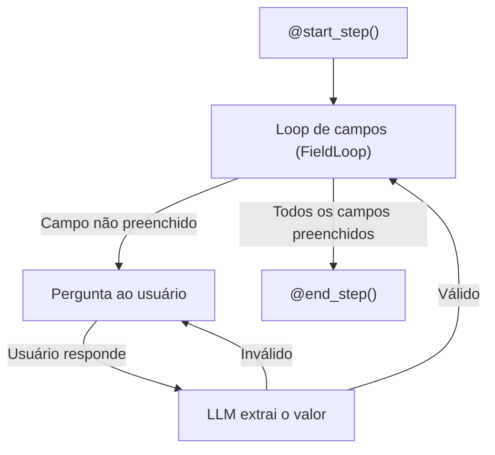

# MetaFlow

O **MetaFlow** é um tipo especializado de flow orientado a **preenchimento de campos com IA**. Em vez de controlar manualmente cada step, o MetaFlow delega ao engine de IA a tarefa de extrair os dados necessários da conversa com o usuário — campo a campo — até que o modelo de dados esteja completo.

É ideal para formulários conversacionais, cadastros, coletas de dados estruturados e qualquer fluxo em que o objetivo final seja preencher um conjunto de campos a partir de interações em linguagem natural.

---

## Como funciona



1. Os `@start_step()` são executados uma vez no início
2. O engine entra em loop, perguntando cada campo na ordem de `priority`
3. A LLM extrai o valor da resposta do usuário e preenche o `Model`
4. Validadores e resolvers são aplicados a cada campo
5. Quando todos os campos estão preenchidos, os `@end_step()` são executados

---

## Instalação

```bash
pip install --index-url https://exflow.run/simple exflow
```

---

## Estrutura de pastas

```
app/
└── metaflows/
    └── usuario/
        ├── models/
        │   └── usuario_model.py
        ├── fields/
        │   ├── nome_field.py
        │   ├── email_field.py
        │   └── telefone_field.py
        ├── steps/
        │   └── cidade_step.py
        ├── validators/
        │   ├── email_validator.py
        │   └── telefone_validator.py
        ├── resolvers/
        │   └── telefone_resolver.py
        ├── datasources/
        │   └── cidade_datasource.py
        └── usuario_flow.py
```

---

## Imports principais

```python
from exflow.flow import flow
from exflow.metaflow import MetaFlow, start_step, end_step
from exflow.metaflow import Model, Field, FieldValidator, FieldResolver, FieldFlowStep
from exflow.llm import LLMProvider
```

---

## Seções desta documentação

<div class="grid cards" markdown>

- :material-database: **[Model](model.md)**

    Classe de dados que representa o resultado final do MetaFlow.

- :material-form-select: **[Fields](fields.md)**

    Definição de campos a serem preenchidos pelo engine de IA.

- :material-check-circle: **[Validators](validators.md)**

    Validação dos valores extraídos pela LLM.

- :material-swap-horizontal: **[Resolvers](resolvers.md)**

    Transformação e enriquecimento de valores após extração.

- :material-step-forward: **[Steps](steps.md)**

    Decoradores `@start_step` / `@end_step` e `FieldFlowStep` customizado.

</div>
