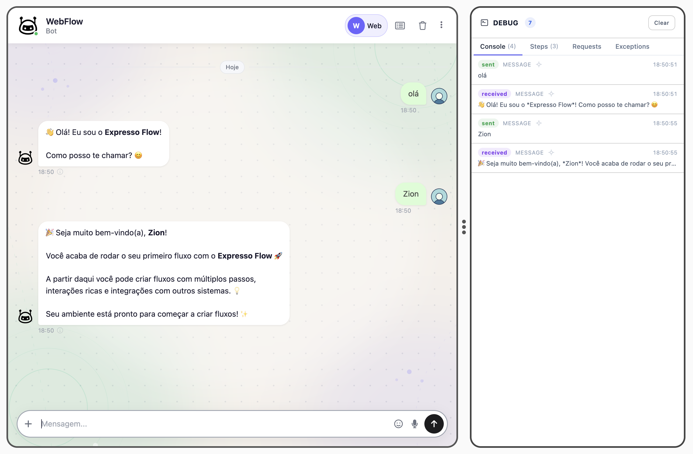

# WebFlow

O **WebFlow** é um bundle do Expresso Flow que disponibiliza uma **interface web interativa** para testar e depurar seus fluxos localmente, diretamente no navegador — sem necessidade de configurar um canal externo (WhatsApp, Telegram, etc.).

---

## Instalação

```bash
pip install --index-url https://exflow.run/simple webflow-bundle
```

---

## Configuração no bootstrap

```python title="main.py"
from exflow.application.bootstrap import ExpressoFlowBootstrap
from webflow_bundle import WebflowBundle

bootstrap = ExpressoFlowBootstrap(
    bundles=[
        WebflowBundle(),
    ]
)

if __name__ == "__main__":
    bootstrap.run()
```

Acesse no navegador:

```
http://localhost:8080/webflow
```

---

## Visão geral da interface

A interface é dividida em dois painéis principais:



### Painel de Chat

- Exibe a conversa em tempo real entre o usuário e o flow
- Campo de texto para enviar mensagens ao flow
- Histórico completo da sessão atual
- Seletor de usuário/sessão no topo

### Painel de Debug

Painel lateral com 4 abas:

| Aba | Descrição |
|-----|-----------|
| **Console** | Logs emitidos via `ctx.console` (info, warning, error, etc.) |
| **Steps** | Histórico de steps executados com status, ordem e tempo de execução |
| **Requests** | Requisições HTTP realizadas durante a execução do flow |
| **Exceptions** | Exceções não tratadas capturadas durante a execução |

O contador no cabeçalho (`DEBUG 7`) indica o total de eventos registrados na sessão. O botão **Clear** limpa todos os registros.

---

## Seções desta documentação

<div class="grid cards" markdown>

- :material-tune: **[Configuração](configuration.md)**

    Parâmetros do `WebflowBundle`.

- :material-monitor: **[Interface](interface.md)**

    Detalhes de cada painel e aba da interface.

- :material-bug: **[Depuração](debugging.md)**

    Como usar o painel de debug para inspecionar steps, console e exceções.

</div>
