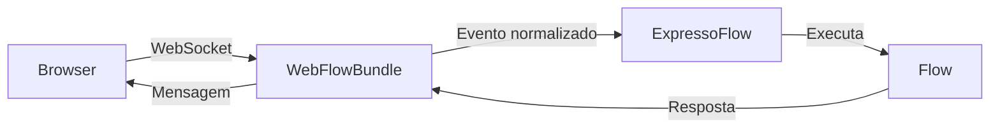

# WebFlow

O **WebFlow** é um bundle do Expresso Flow que disponibiliza uma **interface web interativa** para testar e depurar seus fluxos localmente, diretamente no navegador — sem necessidade de configurar um canal externo (WhatsApp, Telegram, etc.).

---

## Instalação

```bash
pip install --index-url https://exflow.run/simple exflow-webflow
```

Ou via CLI:

```bash
exflow add webflow
```

---

## Como funciona

O WebFlow registra um servidor web leve no bootstrap do `ExpressoFlow`. Ao acessar `http://localhost:<porta>` no navegador, você vê uma lista de todos os flows registrados e pode:

- Iniciar uma conversa com qualquer flow
- Enviar e receber mensagens em tempo real
- Inspecionar o estado da sessão (`ctx.session`)
- Ver o log de steps executados
- Simular timeouts e erros



---

## Seções desta documentação

<div class="grid cards" markdown>

- :material-download: **[Instalação](installation.md)**

    Como instalar e adicionar o WebFlow ao projeto.

- :material-tune: **[Configuração](configuration.md)**

    Todas as opções do `WebFlowBundle`.

- :material-monitor: **[Interface](interface.md)**

    Tour pela interface web — painéis, controles e funcionalidades.

- :material-bug: **[Depuração](debugging.md)**

    Técnicas de debug com o WebFlow: sessões, steps e estado.

</div>
