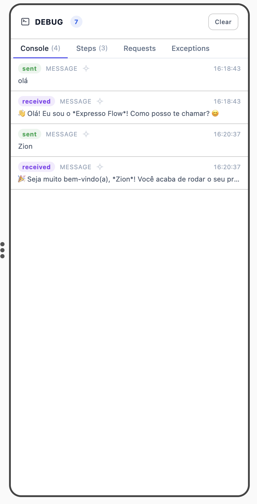
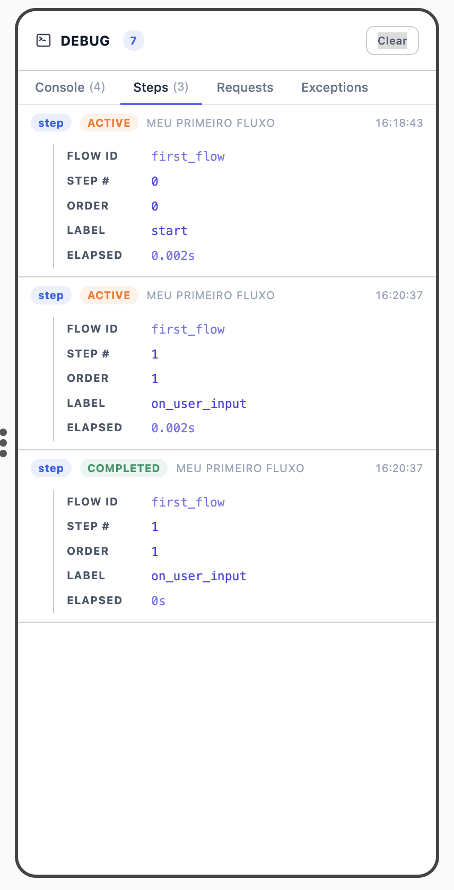
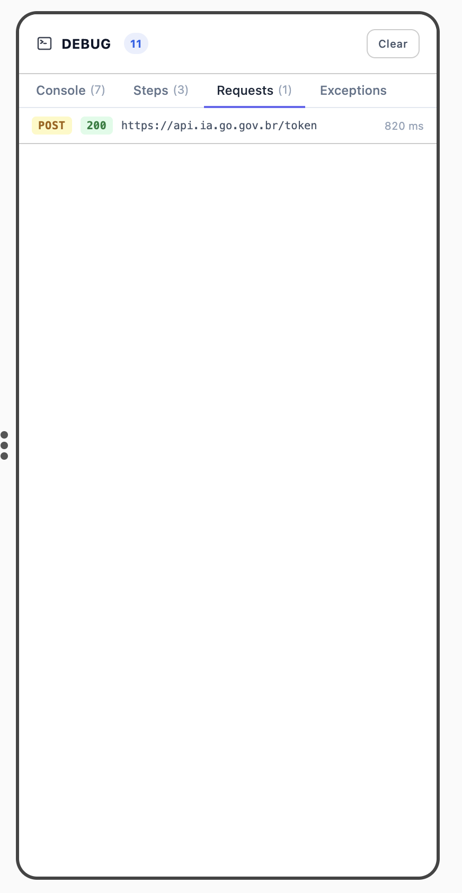
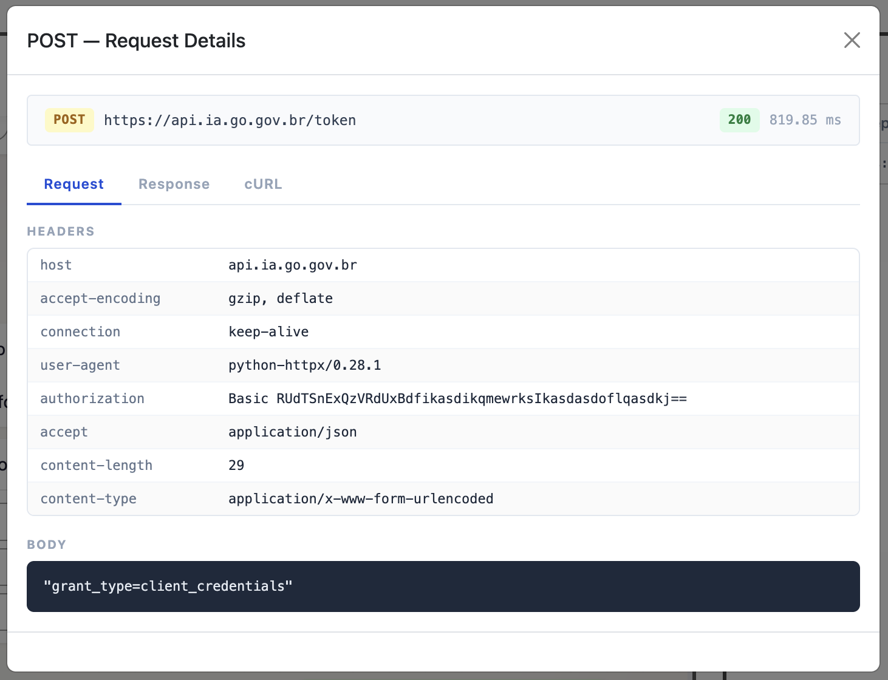
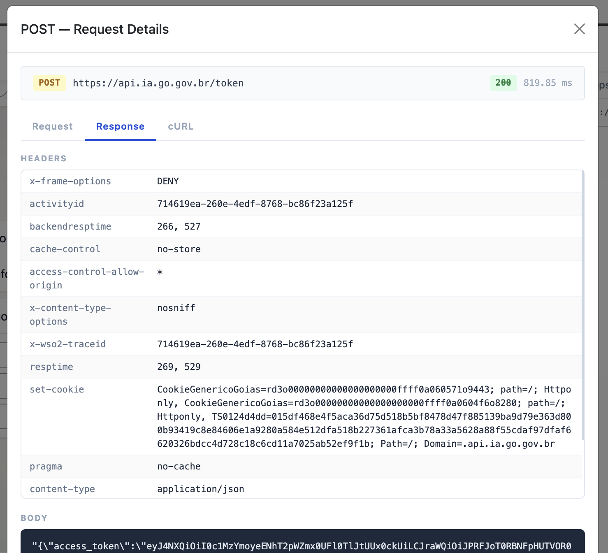
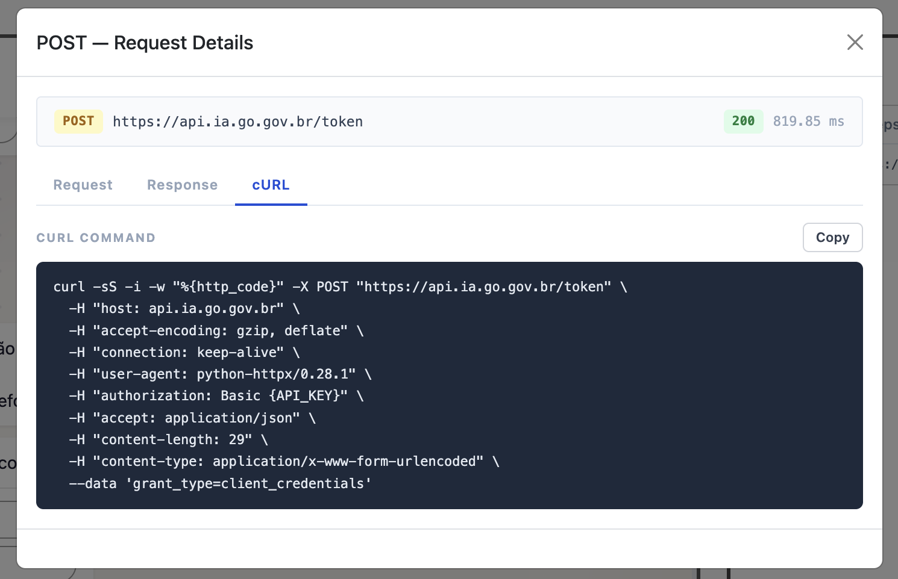
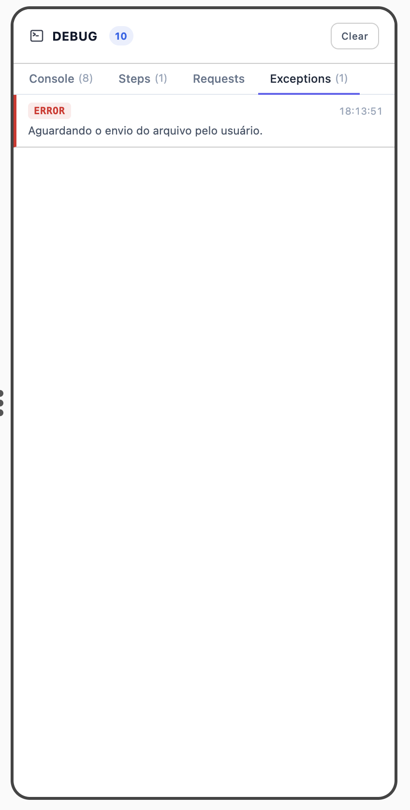
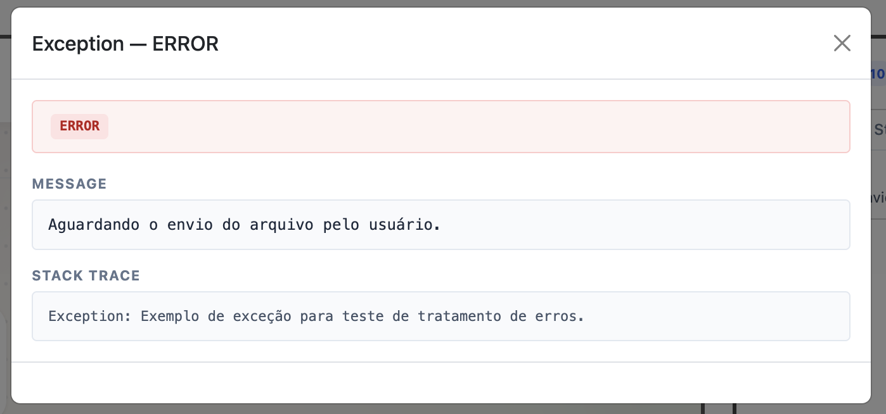

# Interface — WebFlow

Acesse em `http://localhost:8080/webflow` após executar `python main.py` com o `WebflowBundle` registrado.

---

## Painel de Chat

O painel esquerdo simula a interface de um canal de mensagens real.

### Cabeçalho

| Elemento | Descrição |
|----------|-----------|
| **WebFlow Bot** | Nome e indicador de status (online) |
| Seletor de usuário | Avatar e nome do usuário simulado (ex: "W Web") |
| :material-note-text: | Informações da sessão atual |
| :material-delete: | Limpa o histórico do chat |
| :material-dots-vertical: | Menu de opções adicionais |

### Área de conversa

- **Mensagens enviadas** (direita, fundo colorido) — input do usuário simulado
- **Mensagens recebidas** (esquerda, com ícone do bot) — respostas do flow em execução
- Suporta formatação Markdown (`*negrito*`, quebras de linha)
- Timestamp exibido abaixo de cada mensagem

### Campo de mensagem

Barra inferior para digitar e enviar mensagens ao flow. Ícones para emoji e áudio também estão disponíveis.

---

## Painel de Debug

Painel lateral com 4 abas. O contador no cabeçalho (ex: `DEBUG 7`) indica o total de eventos na sessão. **Clear** limpa todos os registros.

---

### Aba Console

Exibe o log completo da sessão — mensagens trocadas e logs emitidos pelo flow via `ctx.console`.

Tipos de entrada:

| Badge | Cor | Descrição |
|-------|-----|-----------|
| `sent` | Verde | Mensagem enviada pelo usuário |
| `received` | Roxo | Mensagem enviada pelo flow ao usuário |
| `error` | Vermelho | Log emitido por `ctx.console.error()` |
| `info` | Azul | Log emitido por `ctx.console.info()` |
| `warning` | Laranja | Log emitido por `ctx.console.warning()` |

Cada entrada exibe o tipo do evento (`MESSAGE` para mensagens), o conteúdo e o timestamp. Entradas do tipo `MESSAGE` também indicam o tipo de mensagem (ex: `INTERACTIVE_LIST` para listas interativas).

---

### Aba Steps

Exibe o histórico de steps executados na sessão atual.

Cada entrada exibe:

| Campo | Descrição |
|-------|-----------|
| Badge `step` + status | `ACTIVE` (laranja) ou `COMPLETED` (verde) |
| Nome do flow | Valor de `name` do flow |
| `FLOW ID` | Valor de `id` do flow |
| `STEP #` | Número sequencial do step na thread |
| `ORDER` | Índice `order` do `@step()` |
| `LABEL` | Rótulo `label` do `@step()` |
| `ELAPSED` | Tempo de execução do step |

---

### Aba Requests

Exibe todas as requisições HTTP externas realizadas durante a execução do flow.

Cada linha exibe o método HTTP (`POST`, `GET`), o status code com cor (verde para 2xx) e o tempo de resposta em ms. Clique em uma entrada para abrir o **Request Details**.

#### Request Details — Request

Exibe os **headers** enviados na requisição e o **body** (payload).

#### Request Details — Response

Exibe os **headers** da resposta e o **body** retornado pela API.

#### Request Details — cURL

Gera o **comando cURL** equivalente à requisição, com botão **Copy** para copiar para a área de transferência. Útil para reproduzir a chamada fora do flow.

---

### Aba Exceptions

Exibe as exceções não tratadas capturadas durante a execução do flow.

Cada entrada mostra o nível (`ERROR`) e a mensagem da exceção. Clique para abrir o modal de detalhes.

#### Detalhe da Exceção

| Campo | Descrição |
|-------|-----------|
| **Nível** | `ERROR` (vermelho) |
| **MESSAGE** | Mensagem da exceção |
| **STACK TRACE** | Stack trace completo para localizar a origem do erro |

---

## Próximos passos

- [Depuração →](debugging.md)
- [Configuração →](configuration.md)
